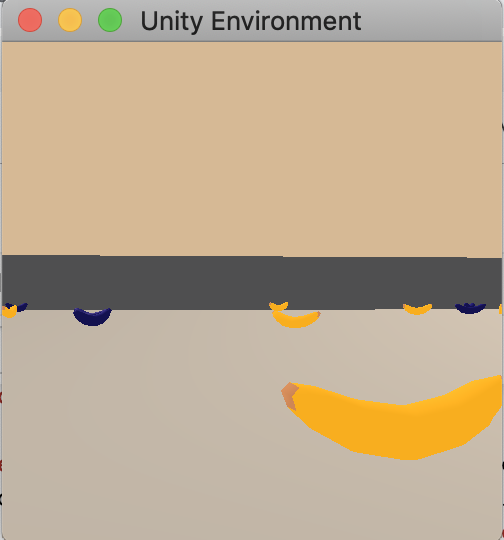

# Deep Reinforcement Learning Nanodegree
Project Solutions for my [Deep Reinforcement Learning Nanodegree at Udacity](https://eu.udacity.com/course/deep-reinforcement-learning-nanodegree--nd893)

## Installation

1. Clone this repository with `git clone git@github.com:squall-1002/deep_rl_nanodegree.git`
2. Set up the conda environment `drlnd.yml` with [Anaconda](https://www.anaconda.com/): `conda env create -f drl.yml`
3. Activate the conda environment with `conda activate drl`

## Project 1: Navigation - training a robot to collect yellow(!) bananas

1. Download the Unity Environment from one of the applicable links below, place the file in `p1_navigation` and unzip the file:
	* [Linux](https://s3-us-west-1.amazonaws.com/udacity-drlnd/P1/Banana/Banana_Linux.zip)
	* [Mac OSX](https://s3-us-west-1.amazonaws.com/udacity-drlnd/P1/Banana/Banana.app.zip)
	* [Windows (32-bit)](https://s3-us-west-1.amazonaws.com/udacity-drlnd/P1/Banana/Banana_Windows_x86.zip)
	* [Windows (64-bit)](https://s3-us-west-1.amazonaws.com/udacity-drlnd/P1/Banana/Banana_Windows_x86_64.zip)

2. In order to train your yellow banana picking agent, navigate into `p1_navigation` and start your JuPyter Notebook server with `jupyter notebook` within the activated environment.
3. Open `navigation_solution.ipynb` which is the notebook that guides you through the steps involved to
	* set everything up,
	* train the agent
	* and evaluate its performance.

You will see the a small window popping up that shows the agent quickly navigating through the environment and - hopefully - collecting the right colored bananas. You will also observe it getting better over time. Therefore, observe the average score counter in the notebook that tells you the average scores the agent achieved across the recent 100 episodes.

The environment is considered solved when the average score of the most recent 100 episodes surpasses `+13`.

### Project Details

The state for the quadratic environment, which contains purple and yellow bananas, is represented with a real-valued vector of size 37. The agent can act upon this environment by moving forward, backward as well as turning left and right. These four actions constitute the action space as follows:

* `0`: move forward
* `1`: move backward
* `2`: turn left
* `3`: turn right

Rewards for collectings bananas are as follows:

* yellow banana: `+1`
* purple banana: `-1`

You may change the following hyperparameters in the dictionary `hyperparams` that is used to create an Agent instance:

* `eps_start`: Start probability to choose a random action when following an epsilon-greedy strategy
* `eps_min`: Minimum probability for epsilon-greedy strategy
* `eps_decay`: Decay Factor for `epsilon` applied every episode
* `learn_rate`: portion of the gradient to use for updating the parameters of the neural network that is used to approximate the action values during training
* `batch_size`: Number of single step experiences (state, action, reward, next state) to constitute a minibatch that is used for the gradient descent update
* `gamma`: discount factor used within the TD-target as part of the parameter update within (Deep) Q-Learning
* `update_interval`: number of steps to perform before updating the target network
* `tau`: interpolation parameter for target network update

Besides these hyperparameters you may also change the number of episodes `n_episodes` and the maximum number of steps `max_steps` before we force an otherwise unfinished episode to end. Both parameters are used for the `perform_dqn_training` method that trains our agent.

## Project 2: Continuous Control - train a double-joined arm to reach bananas

1. Download the environment from one of the links below.  You need only select the environment that matches your operating system:

    - **_Version 1: One (1) Agent_**
        - Linux: [click here](https://s3-us-west-1.amazonaws.com/udacity-drlnd/P2/Reacher/one_agent/Reacher_Linux.zip)
        - Mac OSX: [click here](https://s3-us-west-1.amazonaws.com/udacity-drlnd/P2/Reacher/one_agent/Reacher.app.zip)
        - Windows (32-bit): [click here](https://s3-us-west-1.amazonaws.com/udacity-drlnd/P2/Reacher/one_agent/Reacher_Windows_x86.zip)
        - Windows (64-bit): [click here](https://s3-us-west-1.amazonaws.com/udacity-drlnd/P2/Reacher/one_agent/Reacher_Windows_x86_64.zip)

    - **_Version 2: Twenty (20) Agents_**
        - Linux: [click here](https://s3-us-west-1.amazonaws.com/udacity-drlnd/P2/Reacher/Reacher_Linux.zip)
        - Mac OSX: [click here](https://s3-us-west-1.amazonaws.com/udacity-drlnd/P2/Reacher/Reacher.app.zip)
        - Windows (32-bit): [click here](https://s3-us-west-1.amazonaws.com/udacity-drlnd/P2/Reacher/Reacher_Windows_x86.zip)
        - Windows (64-bit): [click here](https://s3-us-west-1.amazonaws.com/udacity-drlnd/P2/Reacher/Reacher_Windows_x86_64.zip)

2. In order to train version 2 with 20 agents, navigate into `p2_continuous_control` and start your JuPyter Notebook server with `jupyter notebook` within the activated environment.
3. Open `continuous_control_solution.ipynb` which is the notebook that guides you through the steps involved to
	* set everything up,
	* train the agent
	* and evaluate its performance.

The environment is considered solved when the average score of the episode-wise 20-agent averages surpasses `+30` for the most recent 100 episodes.

[//]: # (Image References)

[image1]: https://user-images.githubusercontent.com/10624937/43851024-320ba930-9aff-11e8-8493-ee547c6af349.gif "Trained Agent"
[image2]: https://user-images.githubusercontent.com/10624937/42135623-e770e354-7d12-11e8-998d-29fc74429ca2.gif "Trained Agent"

![Trained Agent][image1]

### Project Details

The state for each agent, which is a double-joint arm, is represented with a real-valued vector of size 33 that correspond to position, rotation, velocity, and angular velocities of the two arm Rigidbodies. The agent can act upon this environment by moving forward, backward as well as turning left and right. The continuous action space is of size four and corresponds to torque applicable to two joints with valid values in the interval `[-1, 1]`

The agent's goal is to reach the sphere that move around and keep its hand with the sphere. For each timestep the agent adheres to this target it receives a reward of `0.1`.

You may change the following hyperparameters in the dictionary `hyperparams` that is used to create an Agent instance:

* `buffer_size`: Maximum number of samples that can be stored in the replay buffer queue
* `batch_size`: Number of single step experiences (state, action, reward, next state) to constitute a minibatch that is used for an agent update
* `update_step`: How many steps to sample before conducting an agent update
* `agent_seed`: Random seed used to initialize the neural network parameters and sampling generators
* `env_seed`: Random seed to initialize the environment
* `gamma`: discount factor used within the TD-target as part of the parameter update within (Deep) Q-Learning
* `tau`: interpolation parameter for soft target network update
* `lr_actor`: Learning rate for the Adam Optimizer used for updating the network parameters of the actor
* `lr_critic`: Learning rate for the Adam Optimizer used for updating the network parameters of the critic

Besides these hyperparameters you may also change the number of episodes `n_episodes` and the maximum number of steps `max_steps` before we force an otherwise unfinished episode to end. Both parameters are used for the `perform_ddpg_training` method that trains our agent.

## Project 3: Collaboration and Competition - train multiple agents to play tennis

1. Download the environment from one of the links below. You need only select the environment that matches your operating system:

	* Linux: [click here](https://s3-us-west-1.amazonaws.com/udacity-drlnd/P3/Tennis/Tennis_Linux.zip)
	* Mac OSX: [click here](https://s3-us-west-1.amazonaws.com/udacity-drlnd/P3/Tennis/Tennis.app.zip)
	* Windows (32-bit): [click here](https://s3-us-west-1.amazonaws.com/udacity-drlnd/P3/Tennis/Tennis_Windows_x86.zip)
	* Windows (64-bit): [click here](https://s3-us-west-1.amazonaws.com/udacity-drlnd/P3/Tennis/Tennis_Windows_x86_64.zip)

2. Place the file in the `p3_collaborate_and_compete/` folder and unzip it.

3. Choose between training or demonstrating the pretrained agent:

	* **Training**:
	
		Open `collaborate_and_compete_solution.ipynb` with JuPyter Notebook to guides you through the steps involved to
		* set everything up,
		* train the agent
		* and evaluate its performance.
	
	* **Demonstrating**

		Open `watch_trained_agent.ipynb` with JuPyter Notebook and execute the cells to see the trained agents successfully playing tennis.

The environment is considered solved when the average score surpasses `+0.5` for the most recent 100 episodes.

![Trained Agent][image2]

### Project Details

In this environment, two agents control rackets to bounce a ball over a net. If an agent hits the ball over the net, it receives a reward of `+0.1`. If an agent lets a ball hit the ground or hits the ball out of bounds, it receives a reward of `-0.01`. Thus, the goal of each agent is to keep the ball in play.

The observation space consists of 8 variables corresponding to the position and velocity of the ball and racket in the following order:

* `racket position x` 
* `racket position y`
* `racket velocity x`
* `racket velocity y`
* `ball position x` 
* `ball position y`
* `ball velocity x`
* `ball velocity y`

For the adapted environment here, for each time step and agent its observation contains three stacked states, the current and the two most recent ones. Thus, stacking three observations of 8 variables results in an agent-specific observation with 3*8 = 24 values for a time step.
Each agent receives its own, local observation. Two continuous actions are available, corresponding to movement toward (or away from) the net, and jumping. They are set to the interval `[-1, 1]`.

The task is episodic, and in order to solve the environment, your agents must get an average score of +0.5 (over 100 consecutive episodes, after taking the maximum over both agents). Specifically,

* After each episode, we add up the rewards that each agent received (without discounting), to get a score for each agent. This yields 2 (potentially different) scores. We then take the maximum of these 2 scores.
* This yields a single score for each episode.

You may change the following hyperparameters in the code:

* `buffer_size`: Maximum number of samples that can be stored in the replay buffer queue
* `batch_size`: Number of single step experiences (state, action, reward, next state) to constitute a minibatch that is used for an agent update
* `n_random_episodes`: Number of episodes of random play to prefill thre Replay Buffer
* `n_episodes`: Number of episodes to train
* `max_steps`: Maximum number of Steps to perform before manually interrupting an episode
* `update_step`: How many steps to sample before conducting an agent update
* `solution_threshold`: Boundary for score average across `eval_window_length` episodes to cross to consider the environment solved
* `eval_window_length`: 100,
* `num_agents`: 2,
* `agent_seed`: Random seed used to initialize the neural network parameters and sampling generators
* `env_seed`: Random seed to initialize the environment
* `buffer_seed`: Random seed to initialize the Replay Buffer Sampling
* `gamma`: discount factor used within the TD-target as part of the parameter update within (Deep) Q-Learning
* `tau`: interpolation parameter for soft target network update
* `first_hidden_units`: Number of hidden units for the first hidden layer of the actor/critic deep neural networks
* `second_hidden_units`: Number of hidden units for the second hidden layer of the actor/critic deep neural networks
* `lr_actor`: Learning rate for the Adam Optimizer used for updating the network parameters of the actor
* `lr_critic`: Learning rate for the Adam Optimizer used for updating the network parameters of the critic
* `critic_weight_decay`: Weight decay to use for critic network weights
* `add_noise`: whether to add or refrain from using noise
* `noise_sigma`: Sigma to use for Ornstein-Uhlenbeck process
* `noise_scale_start`: Initial scale for noise
* `noise_scale_min`: Minimum noise scale
* `noise_scale_decay`: Decay factor for noise scale in each episode
