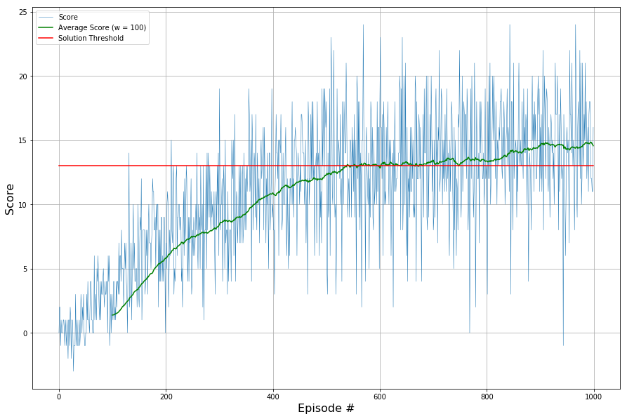

# Project 1: Navigation - Report

* Best agent storage

The model parameters for the agent's `q_network` are stored to `best_banana_picker_agent.pth`. The parameters are kept for the agent that solved the environment (reach at least a score of `+13`) and achieved the highest score among all episodes.

## Learning Algorithm

* learning algorithm: Q-Learning with a neural network for q-value function approximation (see and reference Mnih paper)
* hyperparameters (see README.md, choice of SGD flavor is also a hyperparameter, here it is Adaptive momentum, but it could also be vanilla SGD)
* neural network model architecture (input, hidden, output, no further regularization like dropout, using relu activations, only fully-connected), standard deep feed-forward neural network

## Performance Curve

We can see three lines in the figure below that depicts the performance of our agent across training. The blue line shows the score (sum of rewards per episode) obtained during each episode. The green line is the average score for the latest 100 episodes. The constant red line illustrates the threshold to surpass in order to consider our environment solved which is `+13` for this task.

In this run the agent was able to solve the environment in Episode 538, i.e. in this episode the average score across the most recent 100 episodes crossed was equal or higher than 13 for the first time.

We can also see that the agent keeps improving beyond that point. For example in this run where it finishes with an average score of `14.61` after 1000 episodes. Further training could further improve the performance, but will potentially find its threshold below 20 indicated by the decreasing marginal improvement.

## Ideas for Future Work

* Improve implemented Replay Buffer moving towards **Prioritized Replay**, i.e. picking training samples not uniformly, but weighted by their expected contribution to loss minimization by prioritizing samples with high TD error higher as samples with lower TD error.
* Increase the complexity and thus the capacity of the underlying **neural network** that approximates the q-value function in order to obtain better q-values that yield better decisions and thus higher rewards.
* Increase **input resolution** by shifting from a 37-dimensional state representation to a more accurate state resolution, for example by using the frame sequences with raw pixels and a set of convolutional layers in the beginning of the neural network that are followed by a set of fully-connected layers
* Configure **small negative reward for each non-banana-collecting movement** to encourage the agent to pick up bananas in the most efficient way and thus potentially increase the number of bananas collected per episode
* Perform **extensive hyperparameters search** across:
	* learning rate
	* update interval 
	* discount factor
	* epsilon (minimum, decay factor)
	* train batch size
	* interpolation parameter for target network update

