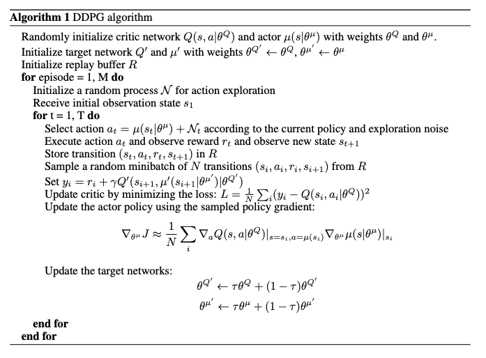
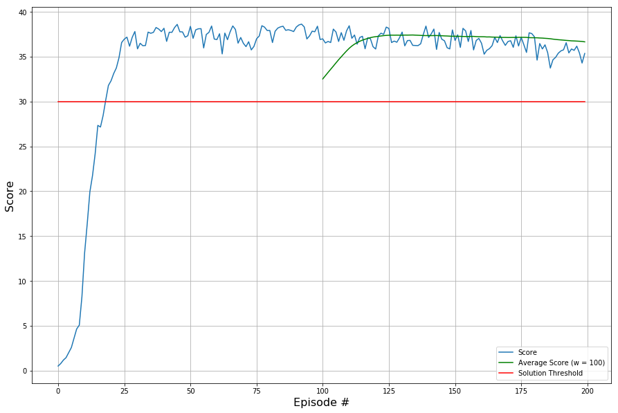

# Project 2: Continuous Control - Report

This report describes the solution for the continuous control project using the Reacher environment with 20 agents. It further outlines the algorithm, chosen network architecture and hyperparameters. I evaluate the average performance across all agents for each episode and provide the average across these averages for the last 100 episodes along with the performance target. In addition, I conclude with a few ideas on further improvements.

The model parameters for the best performing agent, i.e. the local actor and cirtic network parameters can be found in `best_actor_e_93.pth` and `best_critic_e_93.pth`, respectively. Please notice that they may be overwritten once you trigger training using the provided JuPyter notebook.

## Learning Algorithm

To train the agent, I adapted the Deep Deterministic Policy Gradients (DDPG) algorithm according to the DeepMind paper ["Continuous Control with Deep Reinforcement Learning"](https://arxiv.org/pdf/1509.02971.pdf) by Lillicrap et al. This actor-critic algorithm resembles an off-policy approach using a replay buffer and soft updates. Deviating from the authors implementation I perform soft updates every 10th step. Furthermore, I use gradient clipping for the critic's gradients and neither weight decay nor batch normalization or dropout for regularization. I used the following hyperparameters to solve the learning task:

* `buffer_size`: 5e5
* `batch_size`: 512
* `n_episodes`: 200
* `max_t`: 1000
* `update_step`: 10
* `solution_threshold`: 30.
* `eval_window_length`: 100
* `num_agents`: 20
* `agent_seed`: 32
* `env_seed`: 32
* `gamma`: 0.99
* `tau`: 1e-3
* `lr_actor`: 3e-4
* `lr_critic`: 1e-3
* `critic_weight_decay`: 0

Actor and Critic are both standard deep feedforward neural networks. Each network consists of 4 layers (input, first hidden, second hidden, output).
The **actor** turns a state into an action using 33 input units (continuous values representing a state), 128 and 256 units for the first and second hidden layer as well as 4 output units that resemble the continuous actions for both joints of a reacher. The **critic** has a similar structure. It's input layer also consists of 33 input units which are fully connected with the first hidden layer of size 128. The results of this first matrix multiplication and activation is concatenated with the output of an actor-network and fully connected with a second hidden layer of size 256. Finally teh critic-network yields a single value that resembles the action value.

Both networks use `rectified linear units` for their hidden layer activations. The actor uses `tangens hyperbolicus` to obtain values in the valid range of reacher actions. Adaptive Momentum (Adam) is the stochatic gradient descent flavor I use for gradient computation and parameter updates as proposed in the original paper. There are always two copies of a network, the local and the target one. The local versions are updated every `update_step` along with a soft update on the target versions.

Please see the algorithm overview attached for more details:

## Performance Curve

According to the project rubric this 20-agent version of the task is considered to be solved when "the agent is able to receive an average reward (over 100 episodes, and over all 20 agents) of at least +30."

The performance curve below shows the score on the y-axis across 200 episodes of training. There are three lines. The blue line shows the average score across 20 agents for each single episode. The green line shows the average of these agent-averages across the most recent 100 episodes. The constant red line illustrates the threshold to surpass in order to consider our environment solved which is `+30` for this task.

In episode `18` our agent crossed the threshold for the first time. In episode `67` the episodic average crossed the threshold for the first time with `30.03` and from the very first time we could compute the episode-average in episode `100` we were directly able to solve it achieving a performance of `32.52` that further increased beyond 37. The best single performance was in episode `93` with `38.63`. This was also the episode for which we kept our agent's network parameters.

Therefore, we can deem the task to be solved.

## Ideas for Future Work

* Implement a much more efficient version by tracking the bottlenecks during training and resolving inefficient parts of the implementation (training currently takes approximately 90 seconds per episode on my laptop with 3.1 GHz Intel Core i5 and 16 GB Memory without any GPU support), it also seems that the network itself isn't that resource-intense, it is rather the handling elsewhere
* Implement **full random seed controls** in order to make the implementation fully traceable and runs repeatable. This stems from the experience that training DDPG is highly unstable and deviates a lot with minimal parameter changes.
* Increase **input resolution** by shifting from a 33-dimensional state representation to a more accurate state resolution, for example by using the raw pixel version and a set of convolutional layers in the beginning of the neural network that are followed by a set of fully-connected layers
* Perform more extensive hyperparameter search