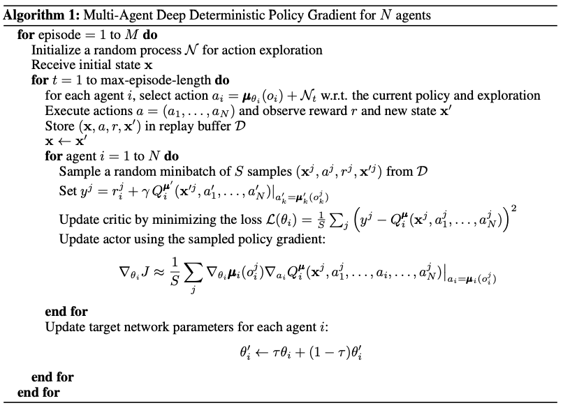
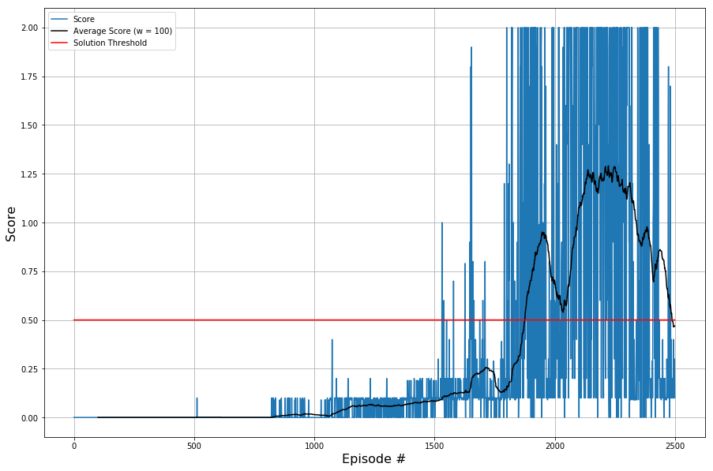

# Project 3: Collaboration and Competition

This final report concludes the Udacity Deep Reinforcement Learning Nanodegree with Multi-Agent Deep Deterministic Policy Gradients (MADDPG) used for training two tennis agents in a collaborative fashion. I will provide algorithmic remarks, the chosen network architecture and hyperparameter settings that led to my solution. Finally, I will outline a few ideas for further improvement of code, efficiency and accuracy.

There are two agents with each having a critic and an actor comprised of deep neural networks. This makes four sets of trained model parameters for my final working solution which are provided along with this repository:

* `agent_0_best_actor_e_1876.pth`
* `agent_0_best_critic_e_1876.pth`
* `agent_1_best_actor_e_1876.pth`
* `agent_1_best_critic_e_1876.pth`

One can load these parameters into the respective models as also shown in `watch_trained_agent.ipynb`.

## Learning Algorithm

To train both agents to maximize cumulative discounted rewards and therefore act in a collaborative fashion, I used the Multi-Agent Deep Deterministic Policy Gradients Algorithm from the paper ["Multi-Agent Actor-Critic for Mixed Cooperative-Competitive Environments"](https://arxiv.org/pdf/1706.02275.pdf) by Lowe et al. from OpenAI and UC Berkeley (also shown in the figure below). Their approach is an actor-critic off-policy based algorithm that borrows from [DDPG](https://arxiv.org/pdf/1509.02971.pdf) and extends to environments with multiple agents that act in mixed fashion by which they relate to cooperation and competition. Similar to the original DDPG-paper the authors propose using a replay buffer `D` and performing soft updates and thus separating into local and target networks for actor and critic of each agent.

My implementation borrows from the ideas mentioned in these papers and yields a proper solution for the following hyperparameters:

* `buffer_size`: 2e5
* `batch_size`: 256
* `n_random_episodes`: 500
* `n_episodes`: 2000    
* `max_steps`: 750
* `update_step`: 4
* `solution_threshold`: .5
* `eval_window_length`: 100
* `num_agents`: 2
* `agent_seed`: 33
* `env_seed`: 33
* `buffer_seed`: 33
* `gamma`: 0.95
* `tau`: 1e-2
* `first_hidden_units`: 256
* `second_hidden_units`: 256
* `lr_actor`: 1e-3
* `lr_critic`: 1e-3
* `critic_weight_decay`: 0
* `add_noise`: True
* `noise_sigma`: 0.2
* `noise_scale_start`: 2.0
* `noise_scale_min`: 0.2
* `noise_scale_decay`: 0.9995

For further details on the network structures, you may refer to [this report on the solution for continuours control](https://github.com/mkurovski/deep_rl_nanodegree/blob/master/p2_continuous_control/Report.md) as well as to the algorithm below. Apart from the paper I decided to implement a replay buffer prefill. This means that for a certain amount of episodes there are purely random action chosen with samples tracked and stored in the buffer. This kicks off exploration and helps later exploitation accordingly.

## Performance Curve

This project is considered solved if the average score across the most recent 100 episodes reaches a threshold of `+0.5`. The episode score is defined as the maximum over the (discounted) cumulative rewards of both agents across the episode.

The performance curve down below shows the score on the y-axis and 2500 episodes of which the first 500 simply prefill the replay buffer by random play. Afterwards learning kicks in with the blue line depicting episode scores. The black line shows the average of the most recent 100 scores. The constant red line illustrates the threshold to surpass in order to consider our environment solved which is`+0.5` for this task.

In episode `1531` the agents crossed the threshold for the first time. In episode `1876` the average crossed the threshold for the first time which is when we were able to solve the environment. From there on the agnts kept further learning reaching a plateau of maximum average scores around `1.25` around episodes 2200 - 2300 before they made quite a significant dip. Further training could help to understand if and how the agents would recover from that dip.

## Further Idea

* Reduce object conversions from NumPy to PyTorch back and forth to speed up the algorithm
* Use a Prioritized Experience Replay instead of randomly generated train batches from the Replay Buffer to speed up convergence and increase accuracy
* Perform extensive Hyperparameter Search to further improve stability and scoring
* Training for more episodes to further increase the score
